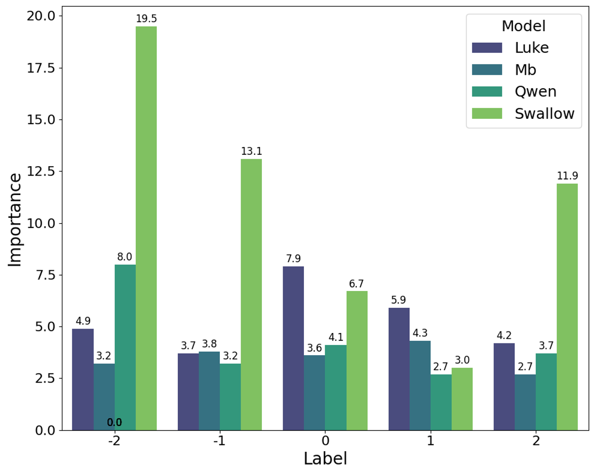

# b3comp

愛媛大学 工学部 人工知能研究室 B3コンペ 手法解説

## タスクの説明

### task
* 日本語の投稿文に対する感情分析
* 書き手の感情極性を -2, -1, 0, 1, 2 の5段階で評価
* 評価指標は**QWK(Quadratic Weighted Kappa)** 
* 期間：2024/10/20 ~ 2025/02/20
* 金銭が発生する手法は禁止

### dataset
* wrimeをもとに作成されたもの
* Train/Dev/Test = 30k/2.5k/2.5k
* 分割の変更は禁止

## 解法

### Overview
* 使用モデルとQWKの値(valid)
    | Model | QWK |
    | --- | --- |
    | tokyotech-llm/Llama-3.1-Swallow-70B-Instruct-v0.3 (4bit量子化) | 0.6129 |
    | cyberagent/DeepSeek-R1-Distill-Qwen-32B-Japanese | 0.6076 |
    | studio-ousia/luke-japanese-large-lite | 0.6534 |
    | csbintuitions/modernbert-ja-130m | 0.6251 |

* 手法
    1. 10-shot の文脈内学習
        tokyotech/swallow と cyber/deepseek-qwen を使用
    2. ファインチューニング
        studio-ousia/luke と csbintuitions/modernbert を使用
    3. XGBoostによるアンサンブル
        各モデルのロジットを入力（後述するジャンル分け情報も入力に使用）

### Detail
1. 10-shot の文脈内学習
    * tokyotech/swallow と cyber/deepseek-qwen を使用
    * ラベルの生成確率を算出し、確率が最も高いラベルを採用（厳密にはすべてのラベルのロジットを取得）
    * 文脈内学習に用いる例文に、推論対象の文章に関連した事例を適用
        - 事前に推論対象の文章を以下の5つにカテゴリ分け
            - 仕事、趣味、生活、人間関係、時事
            - 埋め込みを用いた余弦類似度の適用
                - 埋め込みのベクトルは、以下の2つのモデルのアンサンブル
                - sentence-transformers/paraphrase-multilingual-mpnet-base-v2
                - nlp-waseda/roberta-large-Japanese
           
        - 各カテゴリ向けに用意された10個の文章を提示

2. ファインチューニング
    * studio-ousia/luke と csbintuitions/modernbert を使用
    * 損失関数
        - QWKの式を近似して採用
        $$
        \text{QWK} = 1 - \frac{\sum_{i,j} w_{i,j} O_{i,j}}{\sum_{i,j} w_{i,j} E_{i,j}}
        $$
        - 式におけるOとEを以下のように近似[参考元](https://medium.com/@wenmin_wu/directly-optimize-quadratic-weighted-kappa-with-tf2-0-482cf0318d74)
        - 近似した点
            |  | 近似前 | 近似後 |
            | --- | --- | --- |
            | 観測分布 \(O) | \( O_{i,j} = \sum 1(y_{\text{true}} = i, y_{\text{pred}} = j) \)   クラスごとの出現頻度をカウント | O_{i,j} = \sum_{n} p_{n,j} 1(y_{\text{true},n} = i)   softmaxの確率を重みとして考慮 |
            | 期待分布 \(E) | \( E_{i,j} = \frac{\left( \sum_{k} O_{i,k} \right)   \left( \sum_{k} O_{k,j} \right)}{N} \)   全データの周辺確率 | \( E_{i,j} = \frac{\left( \sum_{n} 1(y_{\text{true},n} = i) \right)   \left( \sum_{m} p_{m,j} \right)}{N} \)   バッチ内のラベルの割合と予測確率による期待値 |

3. XGBoostによるアンサンブル
    * 入力
        - 各モデルのロジット(合計20)
        - カテゴリ情報
    * アンサンブル前後のQWKの値(valid)
        | Model | QWK |
        | --- | --- |
        | tokyotech-llm/Llama-3.1-Swallow-70B-Instruct-v0.3 (4bit量子化) | 0.6129 |
        | cyberagent/DeepSeek-R1-Distill-Qwen-32B-Japanese | 0.6076 |
        | studio-ousia/luke-japanese-large-lite | 0.6534 |
        | csbintuitions/modernbert-ja-130m | 0.6251 |
        | **アンサンブル後** | **0.6705** |

### プログラムの説明
* srcファイル下に配置
1. 10-shot の文脈内学習
    - lm-evaluation-harnessを既存にカスタム
    - ここでは非公開
2. カテゴリ分け
    - make_category.py
2. ファインチューニング
    - luke_train.py
    - Modern BERTに関してはluke非常に類似しているので省略
3. XGBoostによるアンサンブル
    - xgboost.py

### 所感・反省点
* XGBoostの評価
    - XGBoostにおける各特徴量のgain値(重要度)を以下に示す
    
    - Swallowが-2や2で高いスコア
    - Swallow単体のQWKは低いが、アンサンブルでの重要度が高いことから、アンサンブルでモデルの強みを発揮できた
    - 一方で MB(Modern BERT)に関しては改善の余地が大きい

* LLMに対して指示チューニングを行ったが、締め切りに間に合わず断念
* XGBoostのハイパラ調整も時間不足
* 近似QWKの損失関数に関して、有効性を保証できないことに注意
    - 実際に以下のモデルでは学習時のQWKが頭打ちした
    - ku-nlp/deberta-v2-large-japanese